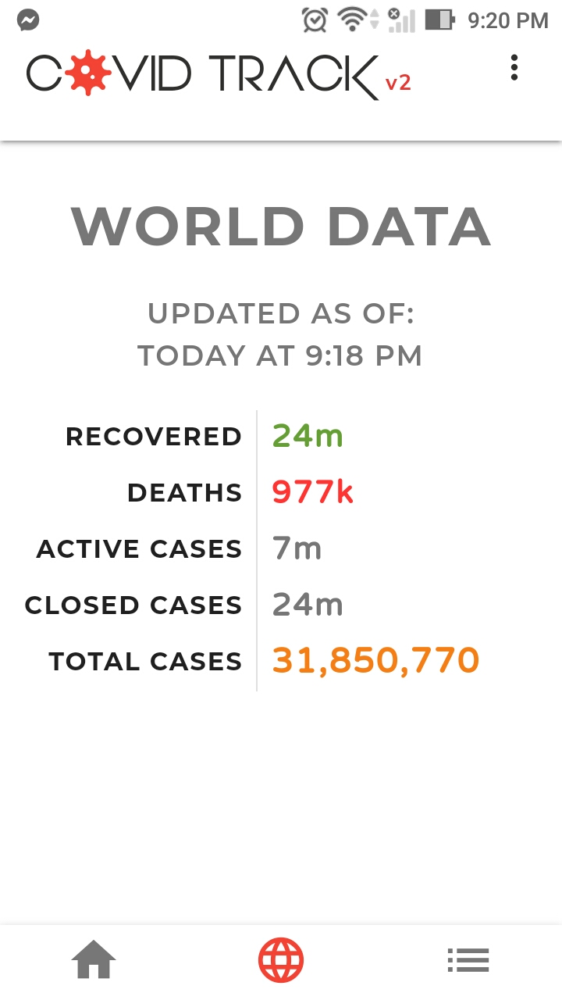
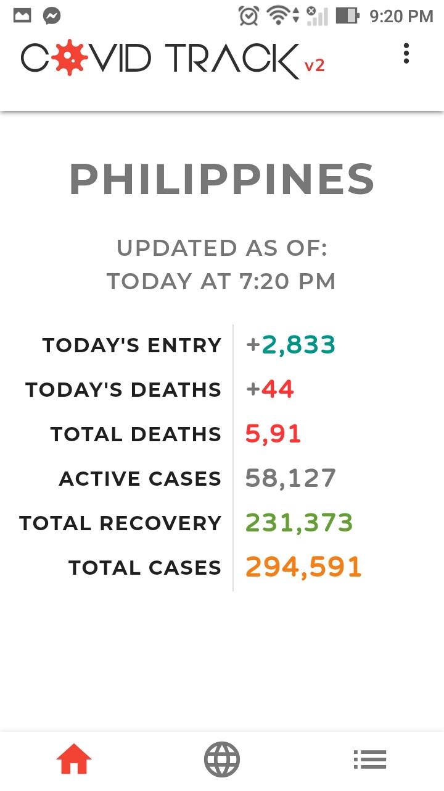
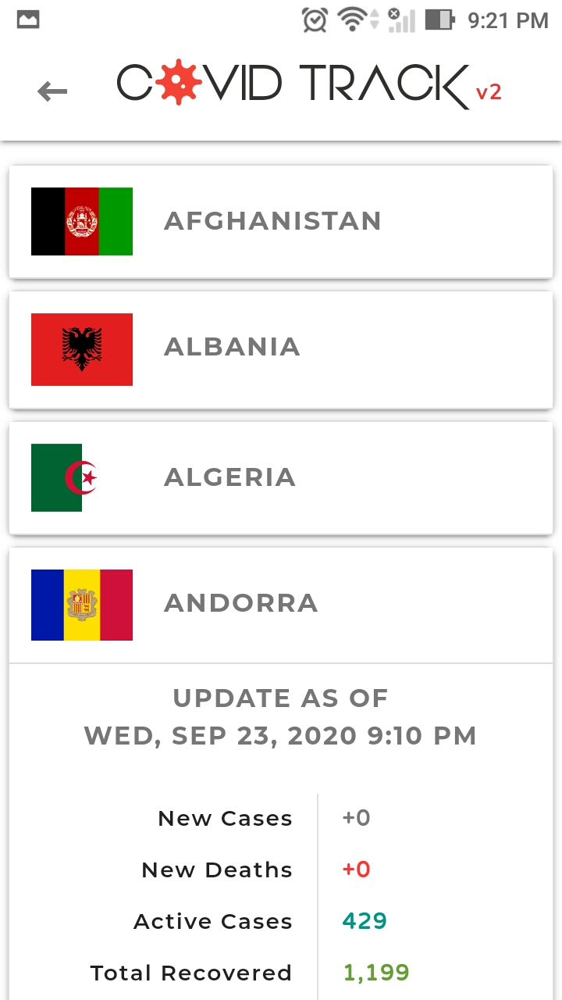
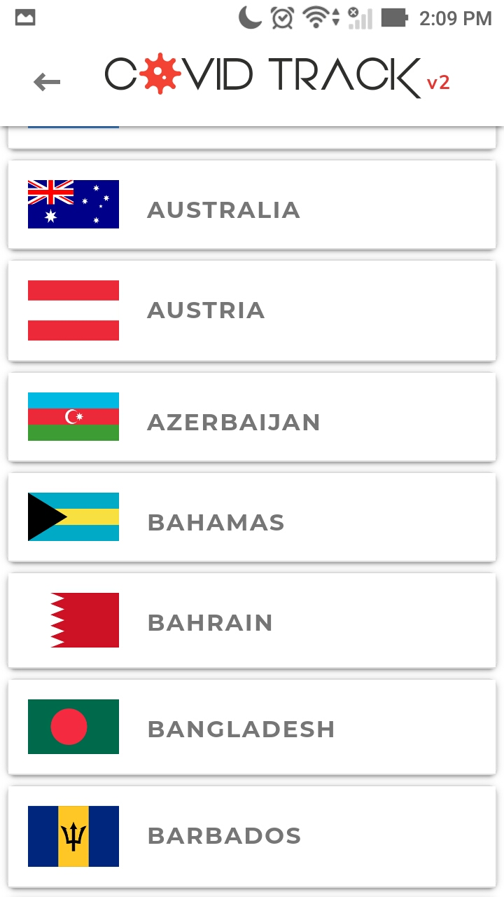
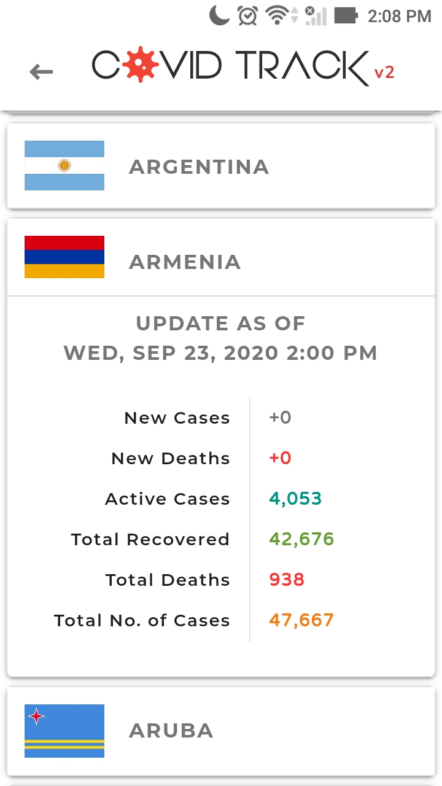

# Covid Track v2

#### Mobile Application using HTMl, CSS and JS and have it compiled using Apache Cordova after.
 

#### *Thank you to the following:*

* [Materializecss](https://materializecss.com/)
* [Fontawesome.com](https://fontawesome.com/)
* [Anime JS](https://animejs.com/)
* [Baffle JS](https://camwiegert.github.io/baffle/)
* [Moment JS](https://momentjs.com/)
* [Numeral JS](http://numeraljs.com/)
* [Extreme-ip-lookup API](https://extreme-ip-lookup.com/json/)
* [Disease.sh API](https://corona.lmao.ninja/)
* [Covid-simple by Satyawikananda.tech](https://covid-simple.satyawikananda.tech/)
* [Apache Cordova](https://cordova.apache.org/)
* [Font Squirrel](https://www.fontsquirrel.com/)
* [Spinkit](https://github.com/tobiasahlin/SpinKit)

 
 
 

> This is just a personal project of mine if you want to give this a try please feel free to download the .apk file listed via this repository.

 
 

#### **Here is a screenshot of the project I created :**
 
 

  

 

 
 

 

 

 

               
               
                   

